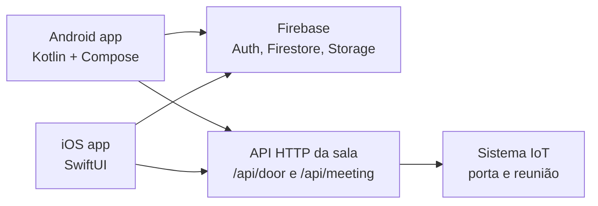

# Arquitetura

## Visão geral

O AppRamo começa como um monorepo com dois aplicativos nativos:

- `apps/android`: app Android em Kotlin, Jetpack Compose e Firebase.
- `apps/ios`: app iOS em SwiftUI e Firebase.

As duas plataformas devem compartilhar o mesmo modelo de dados no Firebase para usuários, tarefas e eventos.

A documentação detalhada por responsabilidade está em [modulos/README.md](modulos/README.md).



## Android

- Entrada: `apps/android/app/src/main/java/com/ramoieeeufjf/appRamo/MainActivity.kt`.
- Navegação: `NavGraph.kt`.
- Telas principais:
  - `ui/screens/RegistrationPage.kt`
  - `pages/LoginPage.kt`
  - `pages/MainPage.kt`
  - `pages/ProfilePage.kt`
  - `pages/MembersPage.kt`
  - `pages/TasksPage.kt`
  - `pages/CalendarPage.kt`
  - `pages/DoorControlPage.kt`
- Dependências principais:
  - Android Gradle Plugin
  - Kotlin
  - Jetpack Compose
  - Firebase Auth, Firestore e Storage
  - Ktor Client
  - Coil

## iOS

- Entrada: `apps/ios/AppRamoIEEE/RamoApp.swift`.
- Estado global: `AppViewModel.swift`.
- Modelos: `Models.swift`.
- Telas principais:
  - `LoginView.swift`
  - `RegistrationView.swift`
  - `MainView.swift`
  - `ProfileView.swift`
  - `EditProfileView.swift`
  - `MembersView.swift`
  - `TasksView.swift`
  - `CalendarView.swift`
  - `DoorControlView.swift`
- Dependências principais:
  - Firebase iOS SDK
  - SDWebImageSwiftUI
  - SDWebImageWebPCoder

## Modelo de dados

### `users/{uid}`

```json
{
  "name": "Nome do membro",
  "email": "membro@exemplo.com",
  "birthDate": "Timestamp",
  "phoneNumber": "(32) 00000-0000",
  "profilePictureUrl": "https://...",
  "chapterRoles": {
    "RAS": "Presidente",
    "IAS": "Membro"
  },
  "requestedChapterRoles": {
    "RAS": "Membro"
  },
  "doorProfileIndex": 7,
  "doorProfileName": "Nome no sistema da porta"
}
```

### `publicProfiles/{uid}`

```json
{
  "name": "Nome do membro",
  "profilePictureUrl": "https://...",
  "chapterRoles": {
    "RAS": "Presidente"
  }
}
```

### `doorProfiles/{uid}`

```json
{
  "firebaseUid": "uid-do-firebase",
  "name": "Nome do membro",
  "doorProfileIndex": 7,
  "doorProfileName": "Nome no sistema da porta",
  "chapter": "CS",
  "role": "Membro",
  "cardCount": 1,
  "doorSource": "192.168.11.2"
}
```

Essa coleção é escrita por ferramenta administrativa e lida pelos apps para montar `profile_indices` no modo reunião sem expor cartões RFID completos.

### `tasks/{taskId}`

```json
{
  "title": "Título da tarefa",
  "description": "Descrição da tarefa",
  "chapter": "RAS",
  "completed": false
}
```

### `events/{eventId}`

```json
{
  "title": "Reunião semanal",
  "description": "Pauta da reunião",
  "location": "Sala do Ramo",
  "startTime": "Timestamp",
  "endTime": "Timestamp",
  "chapter": "RAS"
}
```

## Integrações externas

### Firebase

O Firebase centraliza autenticação, persistência e armazenamento de fotos. Cada plataforma precisa dos arquivos locais de configuração:

- Android: `apps/android/app/google-services.json`.
- iOS: `apps/ios/AppRamoIEEE/GoogleService-Info.plist`.

Esses arquivos não devem ser commitados.

### API da sala

O controle da sala usa a API HTTP exposta pelo sistema da porta com:

- `POST /api/door/open`
- `GET /api/meeting/status`
- `POST /api/meeting/schedule`
- `POST /api/meeting/cancel`
- Header `X-API-KEY` ou `Authorization: Bearer <Firebase ID Token>`

O Android lê `DOOR_API_BASE_URL` e `DOOR_API_KEY` de propriedades Gradle. O iOS lê `DoorAPIBaseURL` e `DoorAPIKey` do `Info.plist`. Quando a chave está vazia, os apps enviam Firebase ID Token para uma API intermediária. O Android ainda aceita os nomes antigos `DOOR_RELAY_BASE_URL` e `DOOR_RELAY_API_KEY` como fallback.

O módulo de controle da sala está detalhado em [modulos/controle-da-sala.md](modulos/controle-da-sala.md), incluindo o contrato esperado pelo app e observações de integração com o projeto IoT do Ramo. O vínculo entre perfis da porta e Firebase está em [modulos/integração porta-Firebase](modulos/integracao-porta-firebase.md).
