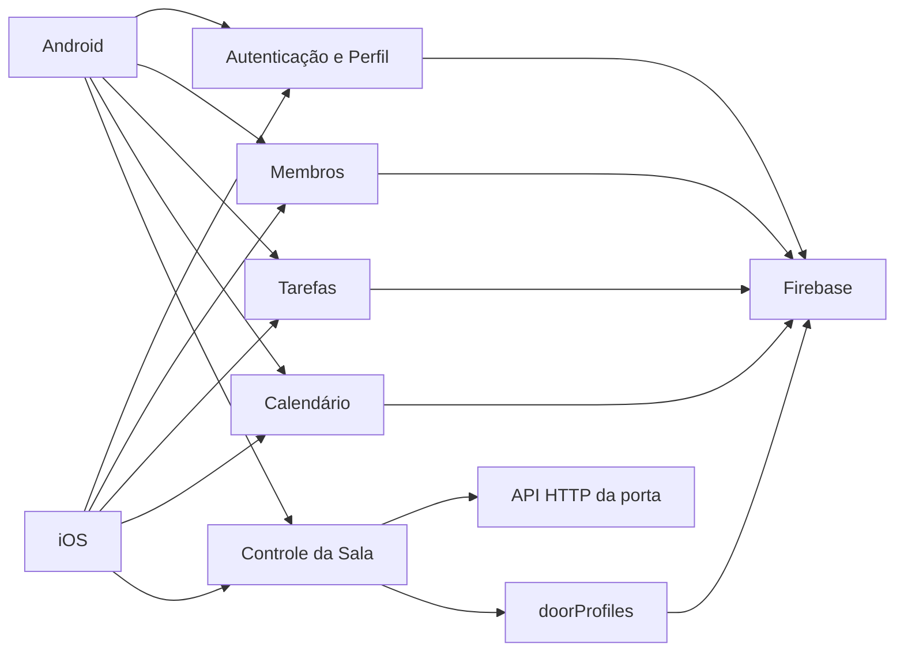

# Módulos do AppRamo

Esta documentação modular foi estruturada com base no formato operacional do projeto `IoT_Ramo_Renesas`: cada módulo descreve responsabilidade, arquivos principais, fluxos, dados, pontos sensíveis e validação.

Referência consultada: [`CSIEEEUFJF/IoT_Ramo_Renesas`](https://github.com/CSIEEEUFJF/IoT_Ramo_Renesas), commit `f82c9726e944df9aad84c4ceee40cd992dfd44e6`.

## Visão geral dos módulos

## Índice

- [Plataformas mobile](plataformas-mobile.md)
- [Autenticação e perfil](autenticacao-e-perfil.md)
- [Membros do Ramo](membros.md)
- [Tarefas do capítulo](tarefas.md)
- [Calendário do capítulo](calendario.md)
- [Controle da sala](controle-da-sala.md)
- [Integração porta-Firebase](integracao-porta-firebase.md)
- [Firebase e dados compartilhados](firebase-e-dados.md)

## Contratos compartilhados

- Usuários são armazenados em `users/{uid}`.
- Tarefas são armazenadas em `tasks/{taskId}`.
- Eventos são armazenados em `events/{eventId}`.
- Perfis da porta vinculados ao Firebase são expostos em `doorProfiles/{uid}` sem UID RFID completo.
- Fotos de perfil ficam no Firebase Storage.
- Eventos e tarefas são filtrados por capítulos do usuário e entradas globais.
- O controle da sala usa a API HTTP da placa com autenticação por chave ou token Firebase via intermediário.

## Convenções de manutenção

- Android continua sendo a referência mínima de escopo funcional até a paridade iOS ser validada.
- Qualquer mudança em modelo de dados deve ser refletida nos dois apps.
- Qualquer mudança na API da sala deve atualizar Android, iOS e [controle-da-sala.md](controle-da-sala.md).
- Credenciais reais nunca devem ser versionadas.
